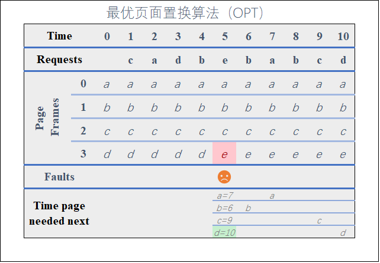
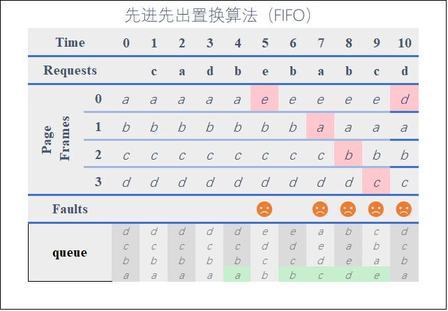
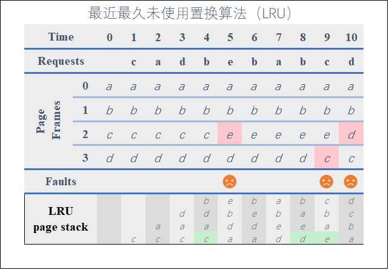
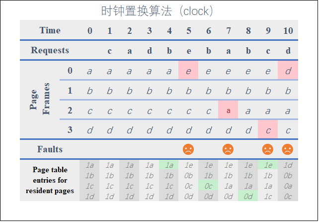
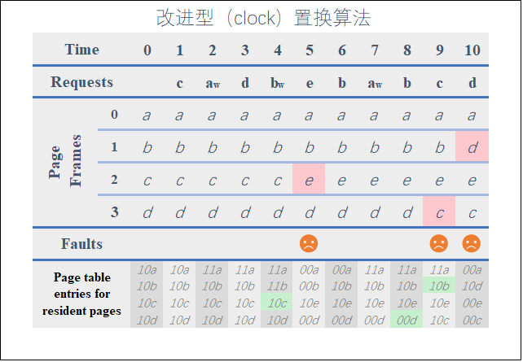

# 内存管理

虚拟内存

虚拟内存，是指具有请求调入功能和置换功能，能从逻辑上对内存容量容量进行扩充的一种存储器系统。

程序的局部性原理(principle of locality)

指程序在执行过程中的一个较短时间，所执行的指令地址和指令的操作数地址分别局限于一定区域，表现为：

- 时间局部性：一条指令的一次执行和下次执行，一个数据的一次访问和下次访问都集中在一个较短的时间里
- 空间局部性：当前指令和领近的几条指令，当前访问的数据和领近的几个数据都集中在一个较小区域内

基于局部性原理，应用程序在运行之前，没有必要全部装入内存，仅须将那些当前要运行的少数页面或短先装入内存便可运行，其余部分暂留在内存上。程序在运行时，如果它所要访问的页（段）已调入内存，便可继续执行下去；但如果程序所访问的页（段）尚未调入内存（称为缺页或缺段），此时程序应利用 OS 所提供的请求调用（段）功能，将它们调入内存，以使程序能够继续执行下去。如果此时内存已满，则须再利用页（段）的置换功能，将内存中暂时不用的页（段）置换到盘上，腾出足够的内存空间后，再将要访问的页（段）调入内存，使程序能够继续执行下去。这样，便可使一个大的用户程序在较小的内存空间上运行；也可在内存中装入更多的进程使它们并发的执行。从用户角度看，该系统所具有的内存容量，将比实际内存容量要大得多。

分页系统地址映射

页面置换算法

功能：当缺页中断发生，需要调入新的页面而内存已满时，选择内存当中哪个物理页面被置换。
目标：尽可能减少页面的换入换出次数(即缺页中断的次数)。把未来不再使用的或短期内较少使用的页面换出，通常只能在局部性原理的指导下依据过去的统计数据来进行预测。
页面锁定(frame locking)：用于描述必须常驻内存的操作系统的关键部分或时间关键(time-critical)的应用进程。实现方法是，在页表中添加锁定标志位(lock bit)。

1. 最佳置换算法（OPT）
   
基本思路：当一个缺页中断发生时，对于保存在内存中的每一个逻辑页面，计算在它的下一次访问之前，还需要等待多长时间，从中选择等待时间最长的那个，作为被置换的页面。
不过，这只是一种理想情况，在实际中无法实现，因为操作系统无法知道每一个页面要等待多长时间以后才会被再次访问。
可用作其它算法的性能评价的依据(在一个模拟器上运行某个程序，并记录每一次的页面访问情况，在第二遍运行时即可使用最优算法)。 

2. 先进先出置换算法（FIFO）
选择换出的页面是最先进入的页面。

该算法会将那些经常被访问的页面换出，导致缺页率升高。

3. 最近最久未使用置换算法（LRU）

虽然无法知道将来要使用的页面情况，但是可以知道过去使用页面的情况。LRU 将最近最久未使用的页面换出。

为了实现 LRU，需要在内存中维护一个所有页面的链表。当一个页面被访问时，将这个页面移到链表表头。这样就能保证链表表尾的页面是最近最久未访问的。

因为每次访问都需要更新链表，因此这种方式实现的 LRU 代价很高。

4. 时钟置换算法（clock）
   
LRU 算法是较好的一种算法，但由于它要求有较多的硬件支持，故在实际应用中，大多采用 LRU 的近似算法。Clock 算法便是其一。时钟置换算法可以认为是一种最近未使用算法，即逐出的页面都是最近没有使用的那个。我们给每一个页面设置一个标记位u，u=1表示最近有使用u=0则表示该页面最近没有被使用，应该被逐出。

5. 改进型 Clock 置换算法
   
在之前的CLOCK算法上面除了使用位(used bit)，还增加了一个修改位(modified bit)，有些地方也叫做dirty bit。现在每一页有两个状态，分别是(使用位，修改位)，  

6. 最少使用置换算法（LFU）

