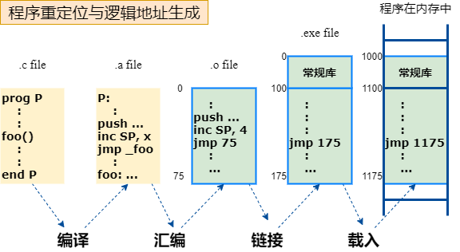

# 预处理，编译，汇编，链接，加载
>计算机组成与设计，软硬件接口
>[gcc/g++等编译器 编译原理： 预处理，编译，汇编，链接各步骤详解](https://blog.csdn.net/elfprincexu/article/details/45043971)
>[编译原理 (预处理,编译,汇编,链接)](https://blog.csdn.net/derkampf/article/details/71597684)
>[gcc命令](https://man.linuxde.net/gcc)

## 概述

一般高级语言程序编译的过程：预处理、编译、汇编、链接。gcc在后台实际上也经历了这几个过程，我们可以通过-v参数查看它的编译细节，如果想看某个具体的编译过程，则可以分别使用-E,-S,-c和 -O，对应的后台工具则分别为cpp,cc1,as,ld。

C和C++编译器是集成的，编译一般分为四个步骤：

预处理(preprocessing)  ----------------- cpp/ gcc -E 
编译(compilation) ------------------ cc1 / gcc -S
汇编(assembly)  -------------------- as
连接(linking) --------------------- ld 

测试用例

~~~c
 //file test.c
 #include <stdio.h>
 int main()
 {
     printf("Hello World!\n");
     return 0;
 }
~~~

## 预处理

预处理是C语言程序从源代码变成可执行程序的第一步，主要是C语言编译器对各种预处理命令进行处理，包括头文件的展开、宏替换、条件编译的选择等。

    gcc -E test.c -o test.i

将test.c预处理输出test.i文件。

## 编译

编译之前，C语言编译器会进行词法分析、语法分析(-fsyntax-only)，接着会把源代码翻译成中间语言，即汇编语言。如果想看到这个中间结果，可以用-S选项。

编译程序工作时，先分析，后综合，从而得到目标程序。所谓分析，是指词法分析和语法分析；所谓综合是指代码优化，存储分配和代码生成。为了完成这些分析综合任务，编译程序采用对源程序进行多次扫描的办法，每次扫描集中完成一项或几项任务，也有一项任务分散到几次扫描去完成的。下面举一个四遍扫描的例子：第一遍扫描做词法分析；第二遍扫描做语法分析；第三遍扫描做代码优化和存储分配；第四遍扫描做代码生成。 

下面我们通过-S选项来看看编译出来的中间结果，汇编语言，还是以之前那个test.c为例。

    gcc -S test.i -o test.s

生成的汇编语言代码为：

~~~mips
	.file	"test.c"
	.text
	.def	___main;	.scl	2;	.type	32;	.endef
	.section .rdata,"dr"
LC0:
	.ascii "Hello World!\0"
	.text
	.globl	_main
	.def	_main;	.scl	2;	.type	32;	.endef
_main:
LFB13:
	.cfi_startproc
	pushl	%ebp
	.cfi_def_cfa_offset 8
	.cfi_offset 5, -8
	movl	%esp, %ebp
	.cfi_def_cfa_register 5
	andl	$-16, %esp
	subl	$16, %esp
	call	___main
	movl	$LC0, (%esp)
	call	_puts
	movl	$0, %eax
	leave
	.cfi_restore 5
	.cfi_def_cfa 4, 4
	ret
	.cfi_endproc
LFE13:
	.ident	"GCC: (i686-posix-dwarf-rev0, Built by MinGW-W64 project) 8.1.0"
	.def	_puts;	.scl	2;	.type	32;	.endef
~~~

## 汇编

汇编器将汇编语言文件翻译成二进制机器指令和二进制数据组成的文件。翻译过程有两个主要步骤。第一步，找到标签（label）对应的内存地址，因此符号名字和指令之间的关系在指令被翻译的时候就被确定了。第二步，将每个汇编语句的数字化的操作码，寄存器指示器和标签翻译成合法的指令。汇编器产生包含程序和数据的二进制表示的目标文件，以及有助于将程序的片段连接起来的信息。UNIX上的目标文件包含6个不同的部分：

- 目标文件头。描述文件中其他段的大小和位置。
- 代码段（text segment）。包含了源文件中程序的机器语言代码。这些程序可能是不可执行的，因为包含了未处理的引用。
- 数据段（data segment）。包含了源文件中数据的二进制表示。数据可能是不完整的，因为为解决的引用可能包含在其他文件中。
- 重定位信息（relocation information）。指明指令和数据字依赖于绝对地址。如果程序中的这些部分在内存中被移动，这些引用必须改变。
- 符号表。包含了源文件中外部标签对应的地址，列出未处理的引用。
- 调试信息。包含了被编译的程序的简介描述，这样调试器可以找到源文件中对应行的指令地址，而且打印出可读形式的数据结构。

    Gcc –c hello.s –o hello.o

## 链接

链接器将多个单独编译的文件融合在一起，以形成可执行文件。它执行三个任务：

- 查询程序库，确保程序不包含未定义的标签。
- 确定每个模块将要占用的内存地址，通过调整绝对引用，将这些指令重定位。
- 解决文件间的引用。

链接器：是一个系统程序，其将独立的二进制机器语言程序，一般指目标文件，组装起来，处理其中未定义的标签，以形成可执行文件。

## 加载

## 总结

