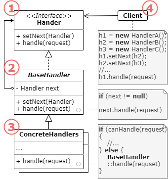

# 设计模式之职责链

>https://refactoringguru.cn/design-patterns/chain-of-responsibility

意图

责任链模式结构

责任链模式适合应用场景

实现方式

责任链模式优缺点

与其他模式的关系

代码示例

# 意图

责任链模式是一种行为设计模式，允许你将请求沿着处理者链进行发送。收到请求后，每个处理者均可对请求进行处理，或将其传递给链上的下个处理者。多个对象都有机会处理请求，从而将请求的发送者和接收者之间解耦，

# 责任链模式结构

1. **处理者**（Handler）声明了所有具体处理者的通用接口。该接口通常仅包含单个方法用于请求处理，但有时其还会包含一个设置链上下个处理者的方法。

2. **基础处理者**（BaseHandler）是一个可选的类，你可以将所有处理者共用的样本代码放置在其中。
   
   通常情况下，该类中定义了一个保存对于下个处理者引用的成员变量。客户端可通过将处理者传递给上个处理者的构造函数或设定方法来创建链。该类还可以实现默认的处理行为：确定下个处理者存在后再将请求传递给它。

3. **具体处理者**（ConcreteHandlers）包含处理请求的实际代码。每个处理者接收到请求后，都必须决定是否进行处理，以及是否沿着链传递请求。

   处理者通常是独立且不可变的，需要通过构造函数一次性地获得所有必要地数据。

4. **客户端**（Client）可根据程序逻辑一次性或者动态地生成链。值得注意的是，请求可发送给链上的任意一个处理者，而非必须是第一个处理者。

# 责任链模式适合应用场景

- 当程序需要使用不同方式处理不同种类请求， 而且请求类型和顺序预先未知时， 可以使用责任链模式。

- 该模式能将多个处理者连接成一条链。 接收到请求后， 它会 “询问” 每个处理者是否能够对其进行处理。 这样所有处理者都有机会来处理请求。

- 当必须按顺序执行多个处理者时， 可以使用该模式。

- 无论你以何种顺序将处理者连接成一条链， 所有请求都会严格按照顺序通过链上的处理者。

- 如果所需处理者及其顺序必须在运行时进行改变， 可以使用责任链模式。

- 如果在处理者类中有对引用成员变量的设定方法， 你将能动态地插入和移除处理者， 或者改变其顺序。

# 实现方式

1. 声明处理者接口并描述请求处理方法的签名。
   
   确定客户端如何将请求数据传递给方法。 最灵活的方式是将请求转换为对象， 然后将其以参数的形式传递给处理函数。

2. 为了在具体处理者中消除重复的样本代码， 你可以根据处理者接口创建抽象处理者基类。
   
   该类需要有一个成员变量来存储指向链上下个处理者的引用。 你可以将其设置为不可变类。 但如果你打算在运行时对链进行改变， 则需要定义一个设定方法来修改引用成员变量的值。为了使用方便， 你还可以实现处理方法的默认行为。 如果还有剩余对象， 该方法会将请求传递给下个对象。 具体处理者还能够通过调用父对象的方法来使用这一行为。

3. 依次创建具体处理者子类并实现其处理方法。 每个处理者在接收到请求后都必须做出两个决定：
   
   - 是否自行处理这个请求
   - 是否将该请求沿着链进行传递。

4. 客户端可以自行组装链，或者从其他对象处获得预先组装好的链。 在后一种情况下， 你必须实现工厂类以根据配置或环境设置来创建链。

5. 客户端可以触发链中的任意处理者， 而不仅仅是第一个。 请求将通过链进行传递， 直至某个处理者拒绝继续传递， 或者请求到达链尾。

6. 由于链的动态性， 客户端需要准备好处理以下情况：

   - 链中可能只有单个链接。
   - 部分请求可能无法到达链尾。
   - 其他请求可能直到链尾都未被处理。

# 责任链模式优缺点

O 你可以控制请求处理的顺序。
O 单一职责原则。 你可对发起操作和执行操作的类进行解耦。
O 开闭原则。 你可以在不更改现有代码的情况下在程序中新增处理者。
X 部分请求可能未被处理。

# 与其他模式的关系

- 责任链模式、 命令模式、 中介者模式和观察者模式用于处理请求发送者和接收者之间的不同连接方式：

  + 责任链按照顺序将请求动态传递给一系列的潜在接收者， 直至其中一名接收者对请求进行处理。
  + 命令在发送者和请求者之间建立单向连接。
  + 中介者清除了发送者和请求者之间的直接连接， 强制它们通过一个中介对象进行间接沟通。
  + 观察者允许接收者动态地订阅或取消接收请求。

- 责任链通常和组合模式结合使用。 在这种情况下， 叶组件接收到请求后， 可以将请求沿包含全体父组件的链一直传递至对象树的底部。

- 责任链的管理者可使用命令模式实现。 在这种情况下， 你可以对由请求代表的同一个上下文对象执行许多不同的操作。

- 还有另外一种实现方式， 那就是请求自身就是一个命令对象。 在这种情况下， 你可以对由一系列不同上下文连接而成的链执行相同的操作。

- 责任链和装饰模式的类结构非常相似。 两者都依赖递归组合将需要执行的操作传递给一系列对象。 但是， 两者有几点重要的不同之处。

- 责任链的管理者可以相互独立地执行一切操作， 还可以随时停止传递请求。 另一方面， 各种装饰可以在遵循基本接口的情况下扩展对象的行为。 此外， 装饰无法中断请求的传递。

# 代码实现

责任链模式在 C++ 程序中并不常见， 因为它仅在代码与对象链打交道时才能发挥作用。

识别该模式可通过**一组对象**的行为方法间接调用其他对象的相同方法来识别， 而且所有对象都会遵循相同的接口。

~~~C++
/**
 * The Handler interface declares a method for building the chain of handlers.
 * It also declares a method for executing a request.
 */
class Handler {
 public:
  virtual Handler *SetNext(Handler *handler) = 0;
  virtual std::string Handle(std::string request) = 0;
};
/**
 * The default chaining behavior can be implemented inside a base handler class.
 */
class AbstractHandler : public Handler {
  /**
   * @var Handler
   */
 private:
  Handler *next_handler_;

 public:
  AbstractHandler() : next_handler_(nullptr) {
  }
  Handler *SetNext(Handler *handler) override {
    this->next_handler_ = handler;
    // Returning a handler from here will let us link handlers in a convenient
    // way like this:
    // $monkey->setNext($squirrel)->setNext($dog);
    return handler;
  }
  std::string Handle(std::string request) override {
    if (this->next_handler_) {
      return this->next_handler_->Handle(request);
    }

    return {};
  }
};
/**
 * All Concrete Handlers either handle a request or pass it to the next handler
 * in the chain.
 */
class MonkeyHandler : public AbstractHandler {
 public:
  std::string Handle(std::string request) override {
    if (request == "Banana") {
      return "Monkey: I'll eat the " + request + ".\n";
    } else {
      return AbstractHandler::Handle(request);
    }
  }
};
class SquirrelHandler : public AbstractHandler {
 public:
  std::string Handle(std::string request) override {
    if (request == "Nut") {
      return "Squirrel: I'll eat the " + request + ".\n";
    } else {
      return AbstractHandler::Handle(request);
    }
  }
};
class DogHandler : public AbstractHandler {
 public:
  std::string Handle(std::string request) override {
    if (request == "MeatBall") {
      return "Dog: I'll eat the " + request + ".\n";
    } else {
      return AbstractHandler::Handle(request);
    }
  }
};
/**
 * The client code is usually suited to work with a single handler. In most
 * cases, it is not even aware that the handler is part of a chain.
 */
void ClientCode(Handler &handler) {
  std::vector<std::string> food = {"Nut", "Banana", "Cup of coffee"};
  for (const std::string &f : food) {
    std::cout << "Client: Who wants a " << f << "?\n";
    const std::string result = handler.Handle(f);
    if (!result.empty()) {
      std::cout << "  " << result;
    } else {
      std::cout << "  " << f << " was left untouched.\n";
    }
  }
}
/**
 * The other part of the client code constructs the actual chain.
 */
int main() {
  MonkeyHandler *monkey = new MonkeyHandler;
  SquirrelHandler *squirrel = new SquirrelHandler;
  DogHandler *dog = new DogHandler;
  monkey->SetNext(squirrel)->SetNext(dog);

  /**
   * The client should be able to send a request to any handler, not just the
   * first one in the chain.
   */
  std::cout << "Chain: Monkey > Squirrel > Dog\n\n";
  ClientCode(*monkey);
  std::cout << "\n";
  std::cout << "Subchain: Squirrel > Dog\n\n";
  ClientCode(*squirrel);

  delete monkey;
  delete squirrel;
  delete dog;

  return 0;
}
~~~