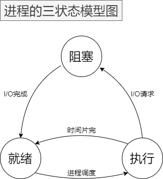
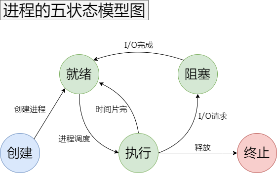
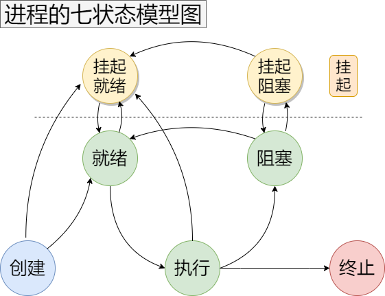

进程的状态与转换

# 进程的三状态模型

运行状态：进程正在CPU上运行。在单处理机系统下，每一时刻最多只有一个进程处于运行状态。

就绪状态：进程已处于准备运行的状态，即进程获得了除处理机之外的一切所需资源，一旦得到处理机即可运行。

阻塞状态：又称等待状态，进程正在等待某一事件而暂停运行，典型的事件有：I/O请求，申请缓冲空间等。
   

就绪 -> 运行：CPU 空闲时选择一个就绪进程。

运行 -> 阻塞：因发生某事件而使进程的执行受阻。
​
阻塞 -> 就绪：进程所需的资源得到满足，如I/O完成。
​
运行 -> 就绪：分配的时间片已完而暂停执行。

# 进程的五状态模型
​
创建状态：对应于进程被创建时的状态，尚未进入就绪队列。

创建一个进程需要通过两个步骤：

1.为新进程分配所需要资源和建立必要的管理信息。

2.设置该进程为就绪态，并等待被调度执行。

终止状态：指进程完成任务到达正常结束点，或出现无法克服的错误而异常终止，或被操作系统及有终止权的进程所终止时所处的状态。

处于终止态的进程不再被调度执行，下一步将被系统撤销，最终从系统中消失。

终止一个进程需要两个步骤：

1.先等待操作系统或相关的进程进行善后处理（如抽取信息）。

2.然后回收占用的资源并被系统删除。

创建 -> 就绪：当操作系统完成了进程创建的必要操作，并且当前系统的性能和虚拟内存的容量均允许。

​运行 -> 终止：当一个进程到达了自然结束点，或是出现了无法克服的错误，或是被操作系统所终结，或是被其他有终止权的进程所终结。

# 进程的七状态模型

挂起状态：三态模型和五态模型都是假设所有进程都在内存中的事实上有序不断的创建进程，当系统资源尤其是内存资源已经不能满足进程运行的要求时，必须把某些进程挂起（suspend），对换到磁盘对换区中，释放它占有的某些资源，暂时不参与低级调度。起到平滑系统操作负荷的目的。

引起进程挂起的原因是多样的，主要有：

1. 终端用户的请求。当终端用户在自己的程序运行期间发现有可疑问题时，希望暂停使自己的程序静止下来。亦即，使正在执行的进程暂停执行；若此时用户进程正处于就绪状态而未执行，则该进程暂不接受调度，以便用户研究其执行情况或对程序进行修改。我们把这种静止状态成为“挂起状态”。 
2. 父进程的请求。有时父进程希望挂起自己的某个子进程，以便考察和修改子进程，或者协调各子进程间的活动。 
3. 负荷调节的需要。当实时系统中的工作负荷较重，已可能影响到对实时任务的控制时，可由系统把一些不重要的进程挂起，以保证系统能正常运行。 
4. 操作系统的需要。操作系统有时希望挂起某些进程，以便检查运行中的资源使用情况或进行记账。 
5. 对换的需要。为了缓和内存紧张的情况，将内存中处于阻塞状态的进程换至外存上。

挂起就绪：进程具备运行条件，但目前在外存中，只有它被对换到内存才能被调度执行。

挂起阻塞：表明进程正在等待某一个事件发生且在外存中。

挂起阻塞 -> 挂起就绪：引起进程等待的事件发生之后，相应的挂起阻塞状态将转换为挂起就绪状态
​
执行 -> 挂起就绪：当一个具有较高优先级的挂起等待态进程的等待事件结束后，它需要抢占 CPU，而此时主存空间不够，从而可能导致正在运行的进程转化为挂起就绪态。另外处于运行态的进程也可以自己挂起自己。

创建 -> 挂起就绪：考虑到系统当前资源状况和性能要求，可以决定新建的进程将被对换出去成为挂起就绪态。